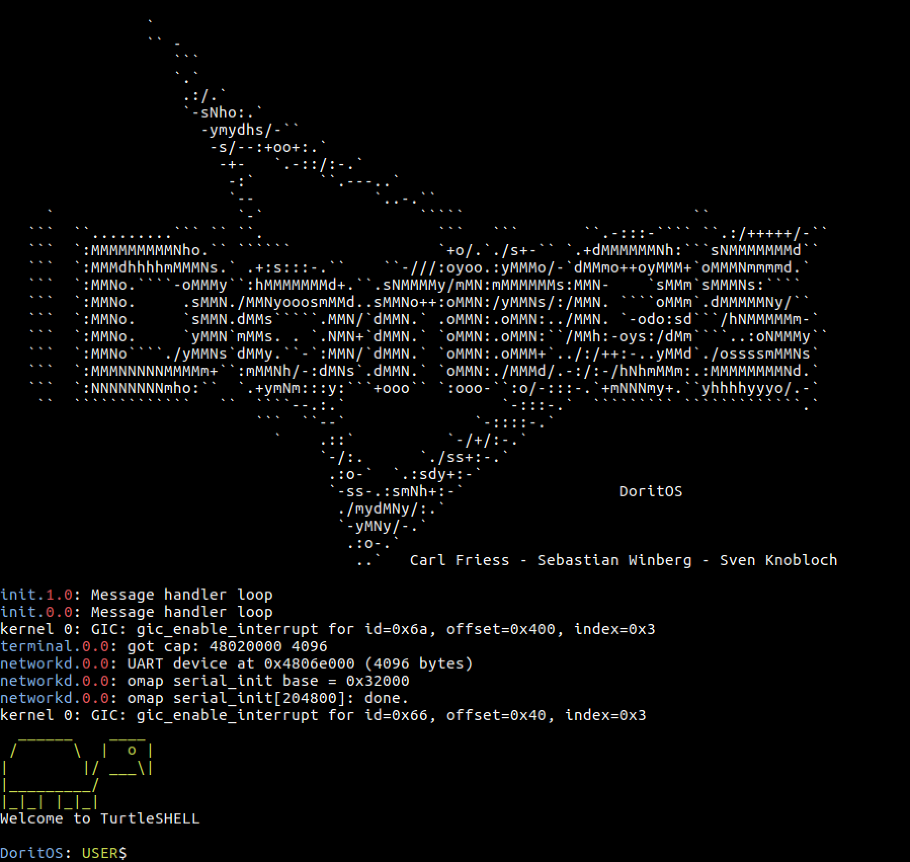

<h1 align="center">DoritOS</h1>

<b> A micro-kernel operating system based on the Barrelfish CPU-driver. </b>

 

DoritOS is an operating system developed during the Advanced Operating Systems course at ETH Zurich in Fall 2018. It implements Virtual Memory Management, Process Management, Lightweight Message Passig, User-level Message Passing, a Shell, a Filesystem and a Network Stack. DoritOS is capable of running on multiple cores and was developed for the ARM Cortex A9 on the OMAP4460 processor using the PandaBoard ES.

<b> <a href="report/report.pdf">Report</a> </b>

 

